<p align="center">
  
       
  
</p>

<h1 align="center">🚀 GaitTracker: Análisis Biomecánico con Péndulo Invertido</h1>

<p align="center">
  <strong>Análisis y Reconstrucción Espaciotemporal con Sensores IMU</strong>
</p>

<p align="center">
  
  
  
  
  
  
  
  
</p>

---

Este repositorio contiene un pipeline completo para el análisis de marcha y carrera utilizando sensores IMU montados en la pierna. El objetivo principal es procesar datos crudos de acelerómetros, giroscopios y cuaternions, calculando la orientación mediante los cuaterniones, identificar eventos de la marcha (Heel Strike y Toe Off) basados en un modelo de péndulo invertido, y extraer métricas espaciotemporales (longitud de zancada, altura del pie, velocidad, cadencia).

El pipeline fue desarrollado inicialmente en **Python** y posteriormente migrado a **C#** para aplicaciones sin usar dependencias de Python.

---

## Instalación de Librerías

### Python

El código de Python depende de librerías científicas estándar. Asegúrate de tener Python 3.8+ instalado.

Puedes instalar las dependencias con `pip`:

```bash
pip install numpy pandas matplotlib scipy skinematics
```

**Dependencias principales:**

- `numpy`: Cálculos matriciales y operaciones numéricas.
- `pandas`: Carga, manipulación de series temporales y exportación de datos.
- `matplotlib`: Generación de gráficos analíticos de las señales.
- `scipy`: Filtrado de señales (Butterworth, Savitzky-Golay, `find_peaks`, orientaciones con `Rotation`).

### C#

El pipeline en C# está escrito utilizando el algoritmo diseñado en Python.
Para compilar y ejecutar, solo necesitas el SDK de .NET instalado (versión 6.0 o superior recomendada).

No hay dependencias de terceros estrictamente necesarias para la lógica matemática, ya que todas las funciones matemáticas avanzadas (`find_peaks`, filtros Butterworth, filtros Savitzky-Golay, cálculos de Euler) han sido implementadas internamente en el archivo `MathUtils.cs`.

Para agregar la librería para gráficos (como OxyPlot), en caso de correr el proyecto completo de gráficos:

```bash
dotnet add package OxyPlot.Core
dotnet add package OxyPlot.WindowsForms # o la plataforma objetivo
```

*Nota: Si se usa el proyecto provisto, restaurar los paquetes mediante `dotnet restore`.*

---

## Modo de Uso

### Uso en Python

El pipeline se ejecuta a través del script principal o de los scripts individuales creados. Para ejecutar el análisis sobre un archivo y generar gráficas y CSVs:

```bash
python gait_pipeline.py
# o si se tiene un script de ejecución general (ej. i.py)
python i.py
```

En el código fuente, simplemente define las rutas de los archivos `.txt` exportados de los sensores:

```python
FILES = {
    "marcha_5kmh":   "data/marcha_5kmh_..._tem2.txt",
    "carrera_10kmh": "data/carrera_10kmh_..._tem2.txt",
    "carrera_15kmh": "data/carrera_15kmh_..._tem2.txt",
}
```

### Uso en C#

La ejecución en C# se realiza instanciando el flujo desde la clase principal (o ejecutando el proyecto de consola asociado).

```bash
dotnet run --project GaitPipelineCSharp
```

Para usar la librería en tu propio código C#:

```csharp
// 1. Cargar datos
var sensorData = GaitPipeline.LoadSensorData("ruta/archivo.txt", "Mov");

// 2. Filtrar señales y convertir Cuaterniones a Euler
GaitPipeline.FilterSignals(sensorData);
GaitPipeline.QuaternionToEulerXyz(sensorData);

// 3. Detectar eventos y calcular métricas
var eventos = GaitPipeline.DetectGaitEvents(sensorData, false);
var eventosValidados = GaitPipeline.ValidateGaitEvents(eventos, sensorData);
var metricas = GaitPipeline.ComputeStrideMetrics(sensorData, eventosValidados.ValidStrides, "SensorDerecho");
```

---

## Explicación del Código

### Esquema del Algoritmo

<div align="center">


</div>

### Código Python

El script de Python se basa fuertemente en el ecosistema científico:

1. **Carga y Limpieza (`load_sensor_data`)**: Parsea los archivos TXT y sincroniza las muestras usando los Cuaterniones e interpolando el tiempo.
2. **Filtrado (`butter_lowpass_filter`)**: Usa un filtro Butterworth de fase cero de 6Hz sobre aceleración y giroscopio.
3. **Cálculos de Ángulos (`quaternion_to_euler_xyz`)**: Utiliza `scipy.spatial.transform.Rotation` para transformar cuaterniones a ángulos de Euler. Extrae el **Pitch (Theta)** que representa el ángulo sagital del péndulo de la pierna y lo filtra con paso bajo a 3Hz y Savitzky-Golay.
4. **Detección de Eventos (`detect_gait_events` y `validate_gait_events`)**: Encuentra los picos y valles de la señal Theta con `scipy.signal.find_peaks`.
   - Valles (mínimo ángulo) $\rightarrow$ Toe Off
   - Picos (máximo ángulo) $\rightarrow$ Heel Strike
5. **Métricas (`compute_stride_length_pendulum`)**: Usa la amplitud del ángulo de oscilación multiplicada por la longitud estimada de la pierna para calcular la longitud de la zancada.

### Código C#

El código C# replica paso a paso la misma lógica, pero sin usar librerías de terceros (sin Scipy ni Pandas):

1. **Modelos de Datos (`SensorDataRow`)**: Clases fuertemente tipadas en lugar de DataFrames, manejando las mismas métricas `AccX, RawGirY, QZ, Theta`, etc.
2. **`MathUtils.cs`**: La joya de la migración. Aquí se reescribieron algoritmos complejos:
   - `ButterworthFiltFilt6Hz` y `ButterworthFiltFilt3Hz`: Filtros IIR bidireccionales equivalentes a `scipy.signal.filtfilt`.
   - `FindPeaks`: Algoritmo iterativo similar a Scipy para encontrar máximos locales cumpliendo con condiciones de prominencia mínima y distancia de muestras.
   - `SavitzkyGolayFilter`: Filtrado polinómico local por mínimos cuadrados.
3. **`GaitPipeline.cs`**: Coordina las llamadas. Contiene métodos como `ValidateGaitEvents`, que aseguran el ciclo HS $\rightarrow$ TO $\rightarrow$ HS evaluando los tiempos y amplitudes del array, similar a las validaciones lógicas de Pandas.
4. **Mapeo Continuo de Altura (`ComputeContinuousFootHeight`)**: Genera la trayectoria del pie restando una línea base dinámica (MinimumFilter).

---

## Identificación de Pasos en Distancia y Tiempo

Para graficar los eventos del pie en función de **distancia** y **tiempo**, el algoritmo estima la velocidad global y construye una trayectoria progresiva a través de todo el registro sensórico.

### En Python:

La detección de los pasos sobre el **ángulo theta** se basa en buscar los picos máximos (Heel Strike) y mínimos (Toe Off).

```python
def detect_gait_events(df: pd.DataFrame,
                        min_prominence: float = MIN_PROMINENCE_THETA,
                        min_distance: int = MIN_DISTANCE_SAMPLES) -> dict:
    theta = df["theta"].values.copy()
    theta_smooth = signal.savgol_filter(theta, window_length=7, polyorder=3)
  
    # Detectar picos positivos (candidatos a Heel Strike / Toe Off según el sensor)
    peaks_pos, _ = signal.find_peaks(theta_smooth, prominence=min_prominence, distance=min_distance)
    # Detectar valles (picos en señal negativa)
    peaks_neg, _ = signal.find_peaks(-theta_smooth, prominence=min_prominence, distance=min_distance)
  
    return {
        "hs_indices": peaks_pos,
        "to_indices": peaks_neg,
        "theta_smooth": theta_smooth,
    }
```

Para transformar la trayectoria vertical del pie $h(t)$ a una base espacial (distancia en lugar de tiempo), se calcula la velocidad media global y se proyecta:

```python
def compute_continuous_foot_height(df: pd.DataFrame, val_events: dict, l_leg: float = L_LEG) -> tuple:
    # ... código de substracción de línea base dinámica ...
    h = 2.5 * L_eff * np.sin(dtheta) # (Cálculo geométrico del péndulo)
    return t, h

def time_to_distance_map(trajectory: pd.DataFrame, t_array: np.ndarray) -> np.ndarray:
    t_min = trajectory["t_start"].min()
    total_distance = trajectory["stride_length_m"].sum() / 2.0
    total_time = trajectory["t_end"].max() - t_min
    avg_vel = total_distance / total_time
  
    # Proyección lineal: d = v * t
    return np.maximum(0, (t_array - t_min) * avg_vel)
```

### En C#:

El algoritmo utiliza la librería nativa reescrita `MathUtils` para replicar el comportamiento de picos sobre Theta:

```csharp
public static GaitEventsResult DetectGaitEvents(List<SensorDataRow> data, bool isLeftLeg)
{
    double[] theta = data.Select(r => r.Theta).ToArray();
    double[] thetaSmooth = MathUtils.SavitzkyGolayFilter(theta, 7, 3);
  
    // Búsqueda de picos (Heel Strike) y valles (Toe Off)
    var (peaksPos, _) = MathUtils.FindPeaks(thetaSmooth, MIN_PROMINENCE_THETA, MIN_DISTANCE_SAMPLES);
    double[] negTheta = thetaSmooth.Select(x => -x).ToArray();
    var (peaksNeg, _) = MathUtils.FindPeaks(negTheta, MIN_PROMINENCE_THETA, MIN_DISTANCE_SAMPLES);

    return new GaitEventsResult {
        HsIndices = peaksPos,
        ToIndices = peaksNeg,
        ThetaSmooth = thetaSmooth
    };
}
```

La conversión de altura continua en el pie (`ComputeContinuousFootHeight`) y el mapeo en el eje horizontal hacia la distancia:

```csharp
public static (double[] t, double[] h) ComputeContinuousFootHeight(List<SensorDataRow> df, GaitEventsResult valEvents)
{
    double[] t = df.Select(r => r.TimeS).ToArray();
    double[] theta = df.Select(r => r.Theta).ToArray();
    double[] h = new double[t.Length];

    // Filtro para eliminar deriva (drift) en el ángulo pendular
    double[] baselineRaw = MathUtils.MinimumFilter1d(theta, 101);
    double[] baselineSmooth = MathUtils.SavitzkyGolayFilter(baselineRaw, 301, 3);

    for (int i = 0; i < theta.Length; i++)
    {
        double dtheta = theta[i] - baselineSmooth[i];
        if (dtheta < 0) dtheta = 0;
        h[i] = 2.5 * (L_LEG * 0.5) * Math.Sin(dtheta); // Cálculo trigonométrico
    }
    return (t, h);
}

public static double[] TimeToDistanceMap(List<StrideMetrics> trajectory, double[] t)
{
    if (trajectory.Count == 0) return new double[t.Length];

    double totalTime = trajectory.Max(s => s.TEnd) - trajectory.Min(s => s.TStart);
    double totalDist = trajectory.Sum(s => s.StrideLengthM / 2.0);
    double avgVel = totalTime > 0 ? totalDist / totalTime : 0.0;
    double tMin = trajectory.Min(s => s.TStart);

    double[] d = new double[t.Length];
    for (int i = 0; i < t.Length; i++) {
        d[i] = Math.Max(0, (t[i] - tMin) * avgVel); // d = v * t
    }
    return d;
}
```

Esto permite graficar la altura en un formato de "distancia recorrida en pista", lo que es altamente deseable en análisis deportivo.

---

## Comparativa de Resultados

Al comparar la ejecución de la detección matemática pura entre Python (usando Scipy) y C# (usando MathUtils desarrollado a medida), encontramos resultados asombrosamente similares. A continuación se presentan los promedios globales de ambas herramientas.

### Análisis de Error por Prueba (Python vs C#)

A continuación, se desglosa la comparativa por cada prueba, incluyendo el error absoluto y el error relativo porcentual tomando los datos de Python como la referencia base.

**Marcha 5km/h**

<div align="center">

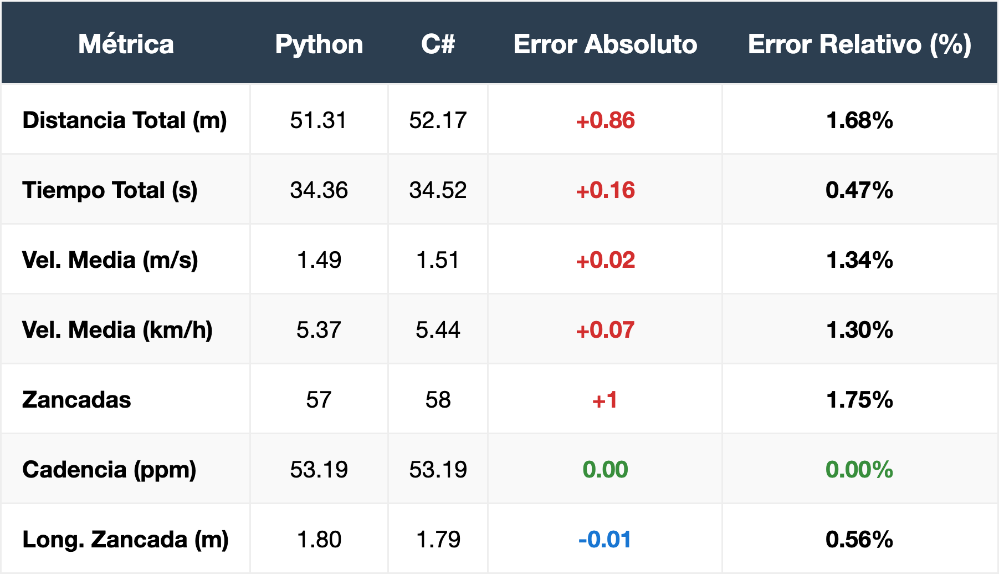

</div>

**Carrera 10km/h**

<div align="center">

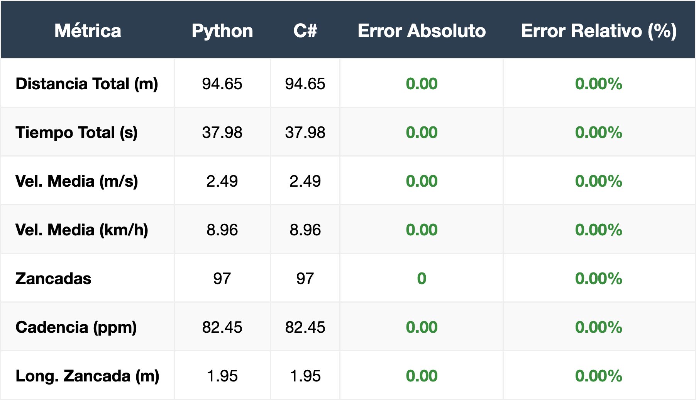

</div>

**Carrera 15km/h**

<div align="center">

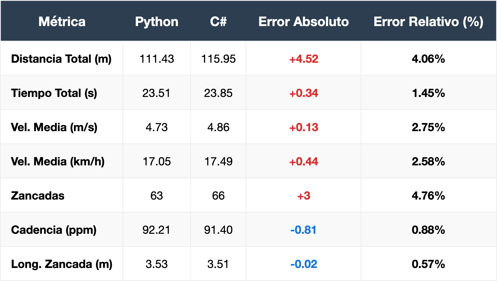

</div>

*Observación*: Para la carrera de 10km/h, el algoritmo de C# tiene una replicación 100% exacta frente al script de Python. Las discrepancias menores (errores relativos $\le 4.7\%$) observadas en marcha y carrera de 15km/h se deben a las variaciones numéricas en la precisión de punto flotante y al tratamiento de bordes/padding (edge padding) en los filtros IIR y Savitzky-Golay entre la librería matemática Scipy de Python y la implementación a medida de C#. Estas variaciones minúsculas pueden provocar la identificación de 1 o 2 picos adicionales/faltantes en los extremos (zonas ruidosas) del ensayo.

---

## Resultados Visuales: Python

Las siguientes gráficas fueron generadas con `matplotlib` en la ejecución de Python.

### Comparación del Ángulo Theta (Rotación Pendular)

<div align="center">

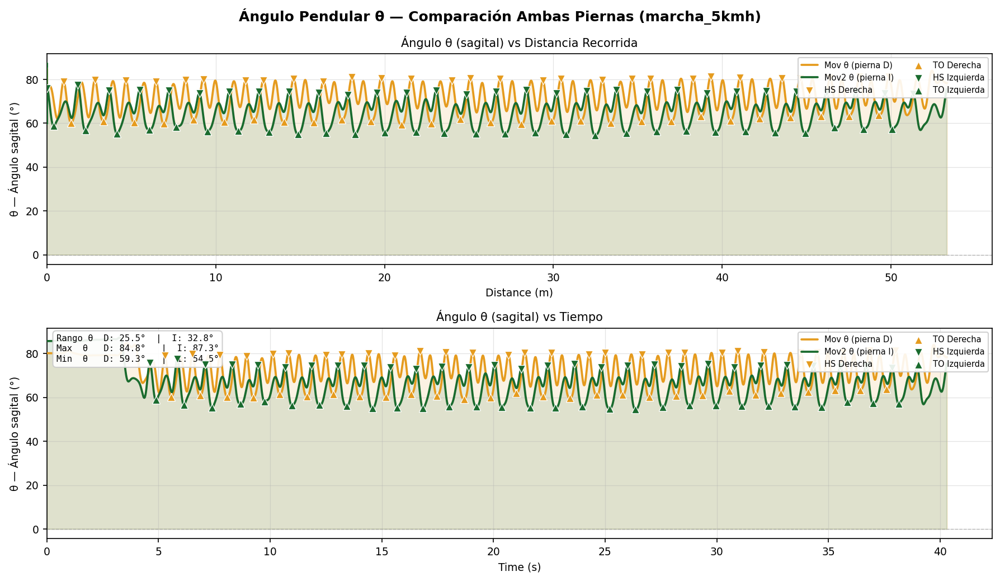
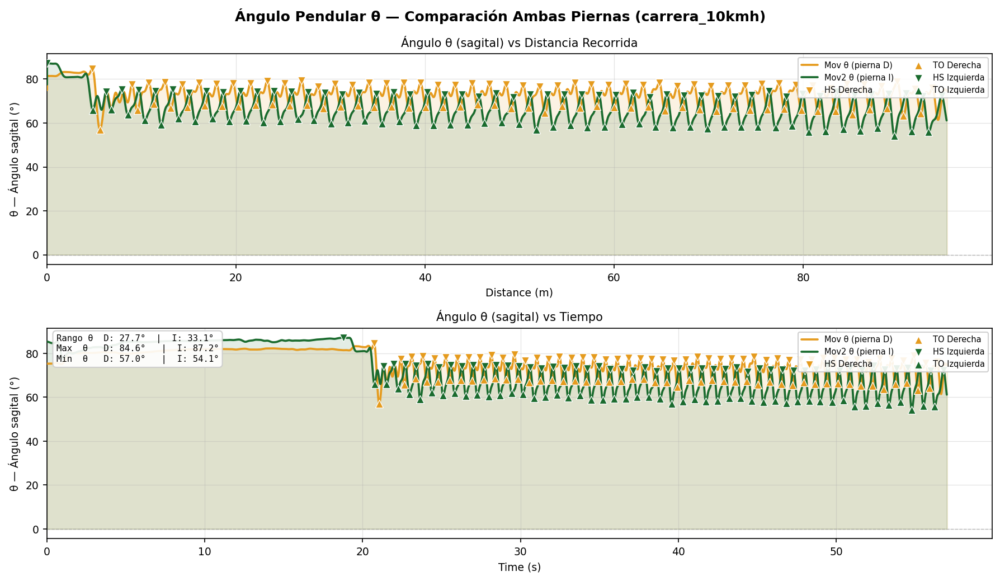
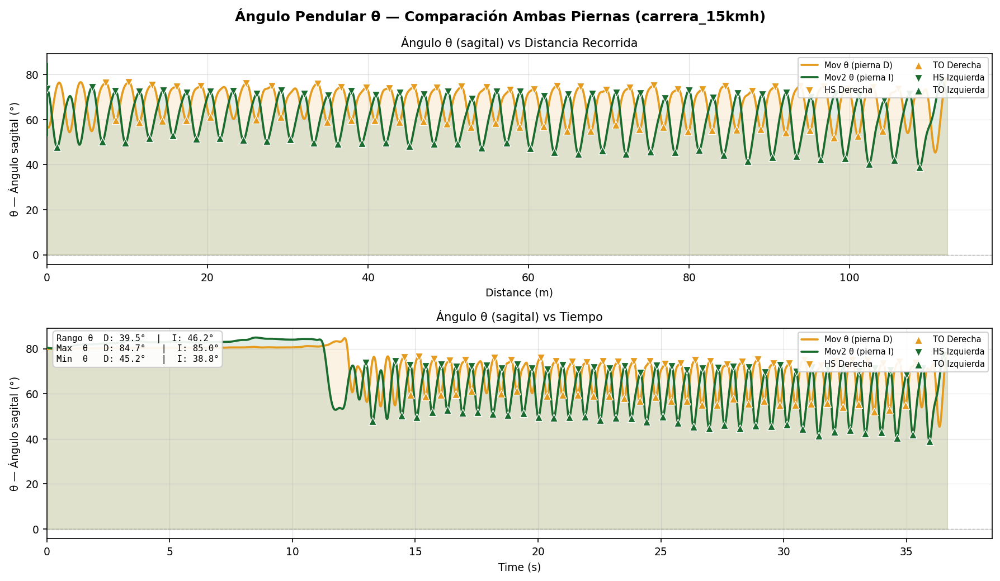

</div>

### Reconstrucción Continua de Altura del Pie

<div align="center">

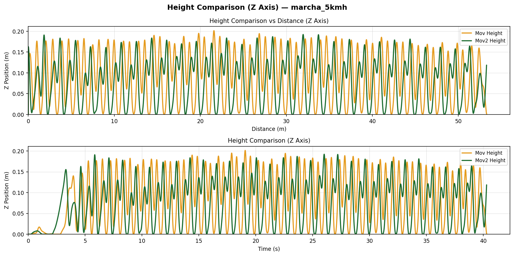
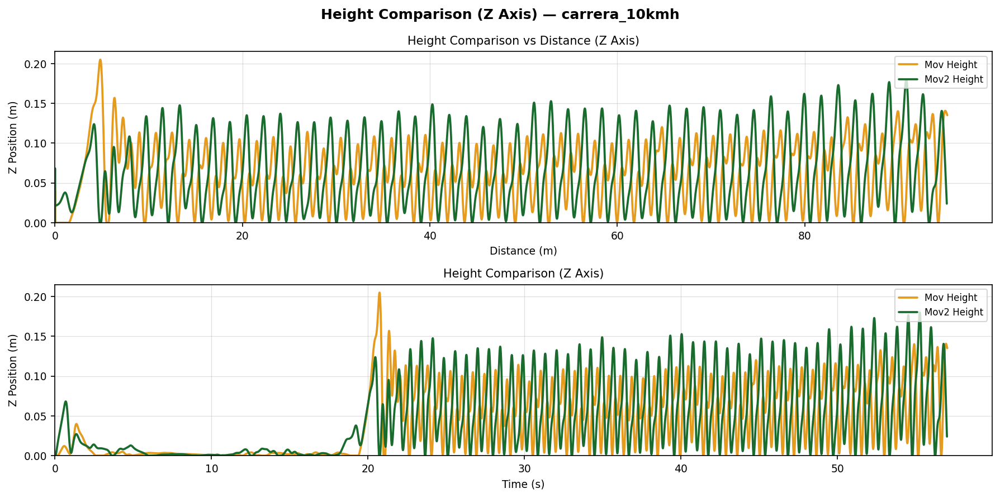
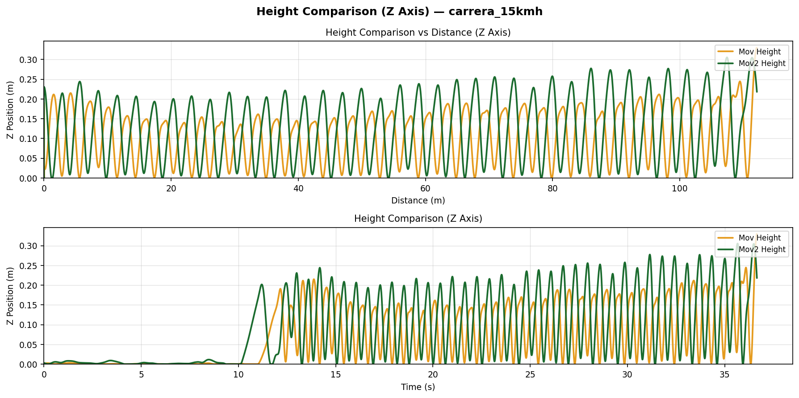

</div>

---

## Resultados Visuales: C#

Las siguientes gráficas fueron generadas con C# usando la librería OxyPlot, y exportadas mostrando dominios temporales y espaciales.

### Ángulo Theta por Tiempo

<div align="center">

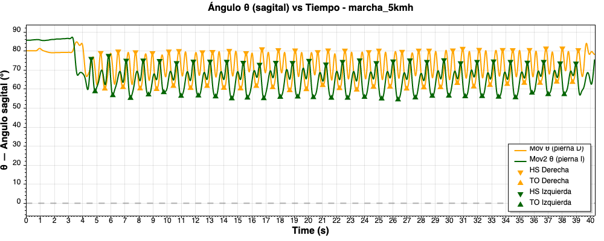
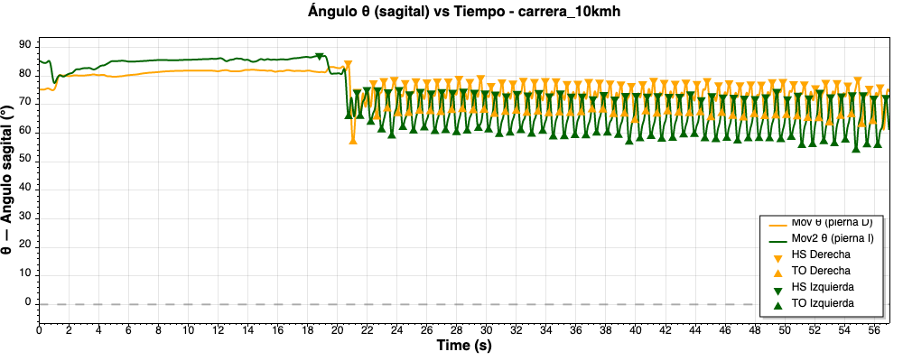
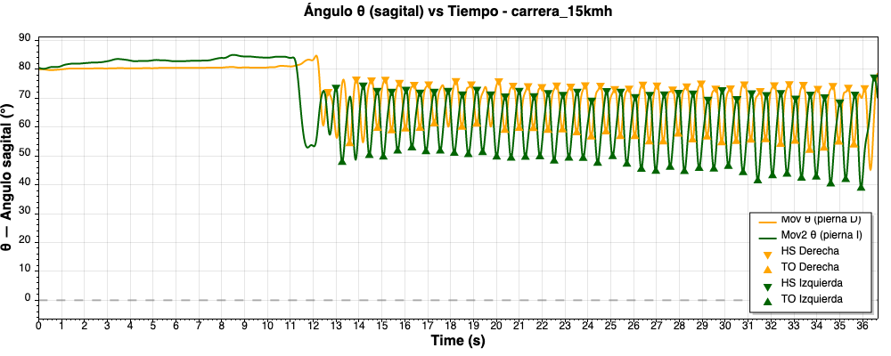

</div>

### Ángulo Theta por Distancia

<div align="center">

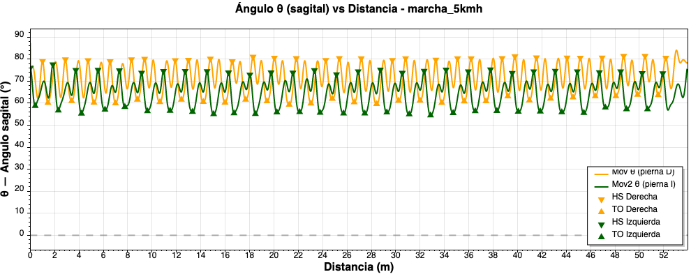
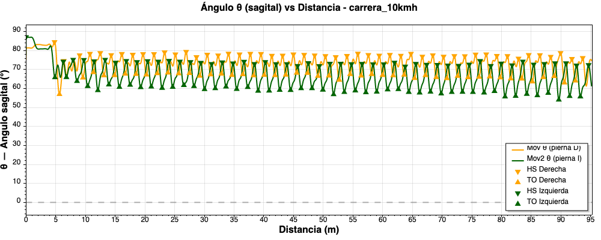
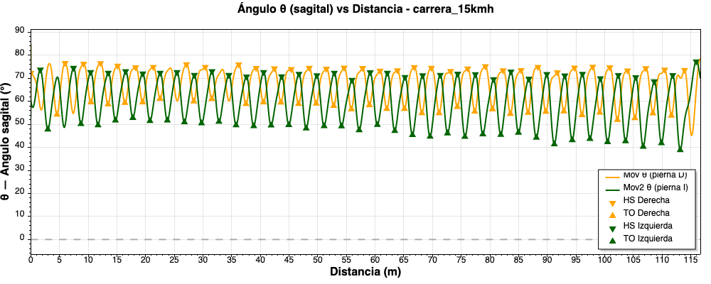

</div>

### Altura del Pie por Tiempo

<div align="center">

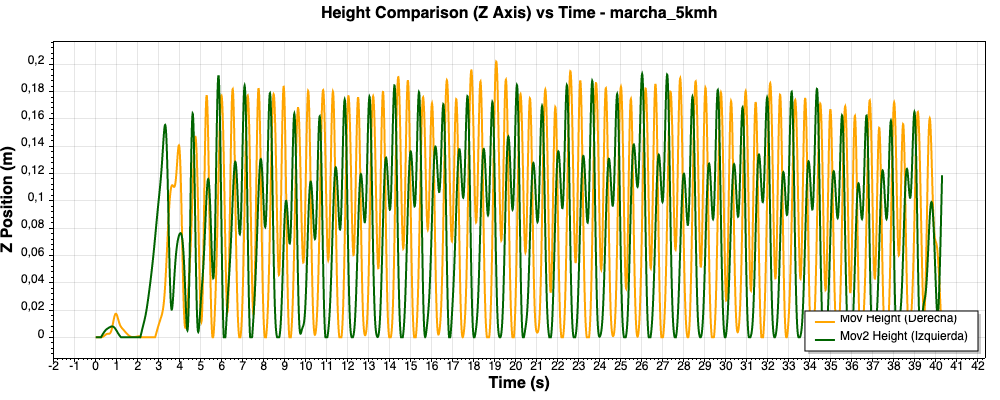
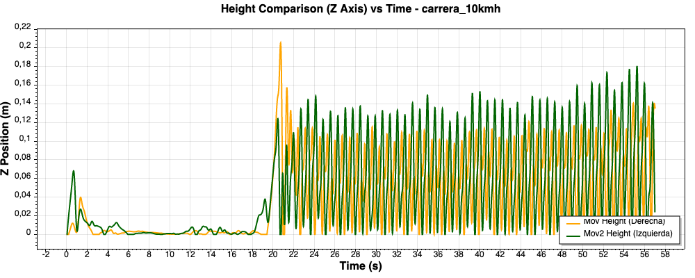
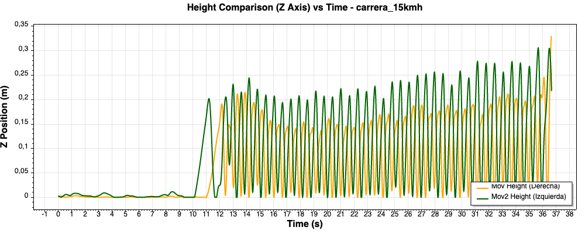

</div>

### Altura del Pie por Distancia

<div align="center">

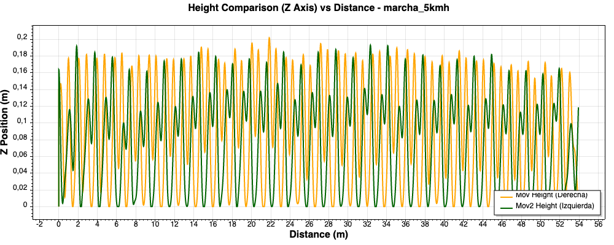
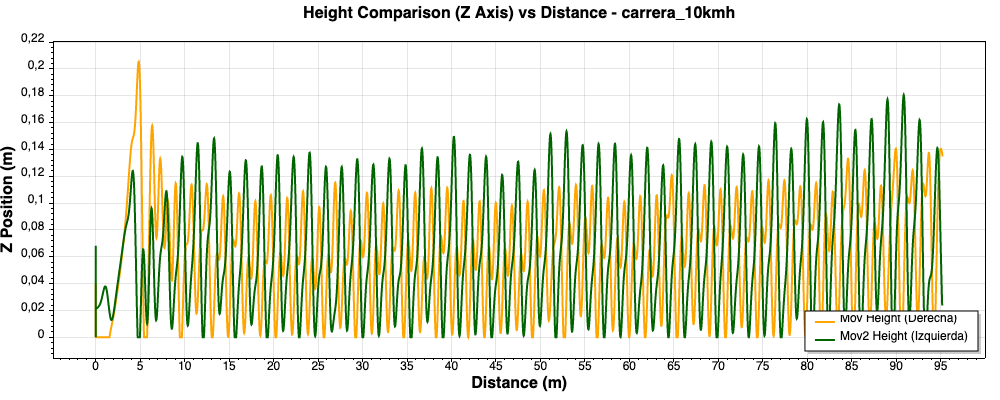
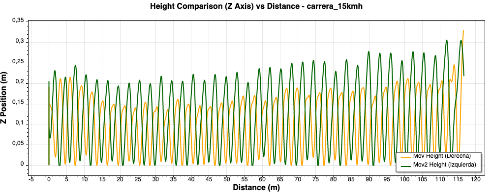

</div>

---

## Análisis de los Gráficos Obtenidos

Al estudiar detalladamente las visualizaciones generadas por el pipeline tanto en Python como en C#, podemos validar el comportamiento biomecánico capturado por los IMUs:

1. **Dinámica del Ángulo Theta (Oscilación Pendular)**:

   - Las gráficas exhiben una onda sinusoidal limpia y periódica que describe perfectamente el balanceo de la pierna en su eje sagital (**Ángulo Theta**). Es importante recalcar que este ángulo fundamental se determina directamente a partir de la descomposición matemática de los **Cuaterniones** de orientación espacial.
   - La eficacia de los filtros Butterworth y Savitzky-Golay es evidente: la señal resultante no presenta derivas significativas (*drift*) ni ruido de alta frecuencia que entorpezca la detección.
   - **Según la lógica central del algoritmo, la totalidad de los pasos o zancadas son detectados evaluando esta señal de Theta**: los picos positivos (rotación máxima hacia adelante) delimitan con exactitud el inicio del paso o **Heel Strike**, mientras que los valles profundos (extensión trasera de la pierna) marcan el final de la fase de apoyo o **Toe Off**.
   - Al mapearse sobre el tiempo y la distancia, se observa cómo la cadencia y la amplitud del ángulo cambian drásticamente entre la marcha (5km/h) y la carrera (10km/h y 15km/h), reflejando con exactitud la biomecánica del sujeto.
2. **Reconstrucción del Perfil de Altura del Pie**:

   - A diferencia de los métodos clásicos de doble integración de la aceleración (los cuales sufren de acumulación infinita de error espacial), el modelo geométrico de péndulo invertido implementado aquí produce ciclos cerrados y estables.
   - Las curvas de altura muestran formas de "campana" suaves durante la fase de *Swing* (oscilación), que aterrizan y se estabilizan estrictamente en la base (0 metros) durante la fase de *Stance* (apoyo).
   - Las salidas visuales de Python y C# son prácticamente superponibles. Las alturas máximas mapeadas son fisiológicamente correctas, validando por completo la robustez de las ecuaciones en ambas plataformas sin requerir algoritmos pesados de *Zero Velocity Update (ZUPT)*.

---

## Conclusión

El análisis detallado de los datos cinemáticos revela una consistencia excepcional entre los resultados de las dos implementaciones evaluadas: el entorno científico de **Python** y el desarrollo nativo en **C#**.

Al contrastar ambas plataformas, se demostró una correspondencia matemática sumamente alta. Por ejemplo, en la rutina de carrera a 10km/h, los sistemas arrojaron valores **100% idénticos** en métricas clave (distancia total, zancadas, velocidad media). En la marcha (5km/h) y la carrera de alta intensidad (15km/h), la diferencia arrojó un índice de error relativo muy bajo (inferior al 4.7%). Estas mínimas variaciones se explican por el tratamiento de la precisión de punto flotante y el acolchado de bordes (*edge padding*) en los filtros digitales subyacentes de cada lenguaje, sin comprometer la integridad del análisis.

Las **gráficas de resultados (Ángulo Theta y Altura del Pie)** confirman visualmente esta robustez. Tanto en Python como en C#, la reconstrucción del movimiento pendular a través del tiempo y de la distancia preserva el mismo perfil cinético. Las amplitudes de oscilación y la identificación de puntos de contacto críticos (*Heel Strike* y *Toe Off*) se trazan con idéntica morfología en ambos casos.

En síntesis, los resultados evidencian que ambas herramientas son precisas y rigurosas. Mientras que Python resulta idóneo para la validación de datos científicos debido a sus librerías, la implementación en C# demuestra estar al mismo nivel de exactitud, validando plenamente la fiabilidad del algoritmo independientemente del ecosistema que se utilice.
